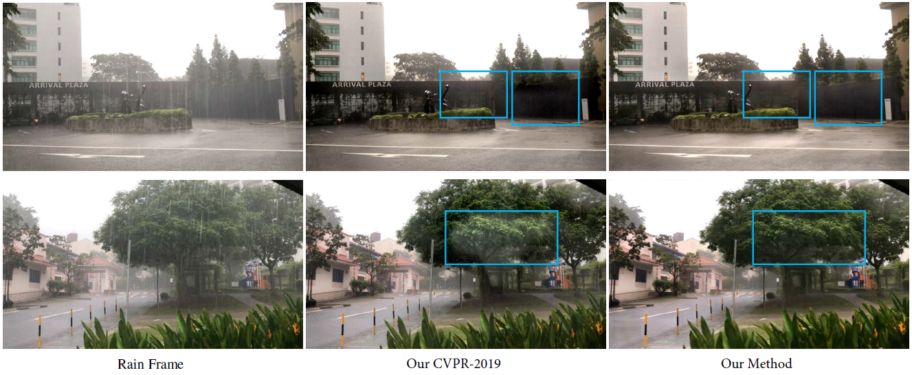

# Recurrent-Multi-Frame-Deraining
## Recurrent Multi-Frame Deraining: Combining Physics Guidance and Adversarial Learning (Submitted to TPAMI)

[Wenhan Yang](https://flyywh.github.io), [Robby T. Tan](https://tanrobby.github.io), [Jiashi Feng](https://sites.google.com/site/jshfeng), [Shiqi Wang](https://www.cs.cityu.edu.hk/~shiqwang/), and [Jiaying Liu](http://www.icst.pku.edu.cn/struct/people/liujiaying.html)

[[Paper Link]](TBD) [[Project Page]](https://github.com/flyywh/Recurrent-Multi-Frame-Deraining)

### Abstract

Existing video rain removal methods mainly focus on rain streak removal and are solely trained based on the synthetic data, which neglect more complex degradation factors, e.g. rain accumulation, and the prior knowledge in real rain data. Thus, in this paper, we build a more comprehensive rain model with several degradation factors and construct a novel two-stage video rain removal method that combines the power of synthetic videos and real data. Specifically, a novel two-stage progressive network is proposed:  recovery guided by a physics model, and further restoration by adversarial learning. The first stage performs an inverse recovery process guided by our proposed rain  model. An initially estimated background frame is obtained based on the input rain frame. The second stage employs adversarial learning to refine the result, i.e. recovering the overall color and illumination distributions of the frame, the background details that are failed to be recovered in the first stage, and removing the artifacts generated in the first stage. Furthermore, we also introduce a more comprehensive rain model that includes degradation factors, e.g. occlusion and rain accumulation, which appear in real scenes yet ignored by existing methods. This model, which generates more realistic rain images, will train and evaluate our models better. Extensive evaluations on synthetic and real videos show the effectiveness of our method in comparisons to the state-of-the-art methods.

## Prerequisites
- Linux or macOS
- Python 3
- NVIDIA GPU + CUDA cuDNN
- PyTorch 0.4

## Detailed configuration (TBD)

## Training and testing examples
- 1st stage training and testing (without GAN): ./Recurrent_multi_frame_deraining_wo_gan/train_video_rain.sh, ./Recurrent_multi_frame_deraining_wo_gan/test_video_rain.sh
- 2nd stage training (with GAN, intialized the model with the 1st stage's model): ./Recurrent_multi_frame_deraining_w_gan/train_video_rain.sh, ./Recurrent_multi_frame_deraining_w_gan/test_video_rain_real.sh

## Datasets
- Proposed Training set: 
- Proposed Testing set: [Baiduyun(code: 0ike)](https://pan.baidu.com/s/1ZZTvEvLPpQRU1mL4rl1xvQ)

## Results
- Proposed Testing set: [Baiduyun(code: 7uzp)](https://pan.baidu.com/s/1sYYVZYpGAhJcnp-ZhYgEXQ)
- Real videos: [Baiduyun(code: gl5r)](https://pan.baidu.com/s/12ajZ9Mb2jB5J7_TWU3XHug) 